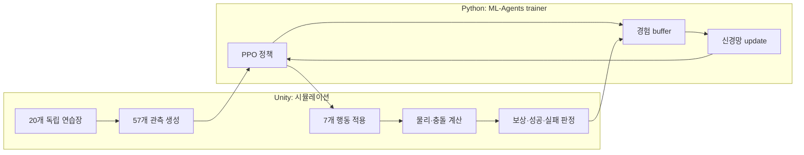
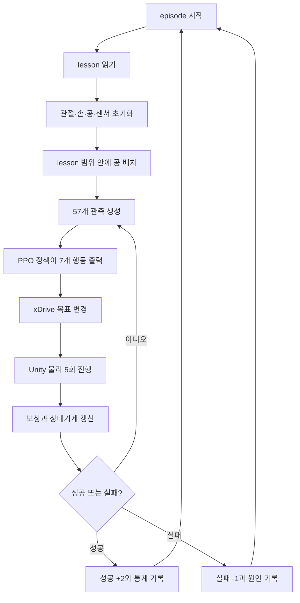

> **폐기된 closure/v4 복합 보상 문서:** 현재 joint26 v1→v4 흐름은
> [`train_plan.md`](train_plan.md)를 따른다.

# DG5FGraspV4 강화학습 입문과 전체 흐름

이 문서는 Unity나 강화학습을 처음 접한 사람이 **이 프로젝트에서 무엇이 움직이고, 무엇을
학습하며, 코드가 어떤 순서로 실행되는지** 이해하기 위한 첫 문서다.

- 정확한 숫자와 변경 금지 인터페이스: [`AGENT_SPEC.md`](AGENT_SPEC.md)
- 설계 의도와 평가 기준: [`ML_AGENTS_DESIGN.md`](ML_AGENTS_DESIGN.md)
- 실제 실행 명령: [`ML_AGENTS_TRAINING_GUIDE.md`](ML_AGENTS_TRAINING_GUIDE.md)

현재 구현은 `DG5FGraspV4` 계약이다. 목표는 UR5e 로봇팔과 DG5F 로봇손이 빨간 공에
접근하고, 잡고, 들어 올린 뒤 안정적으로 유지하는 정책(policy)을 학습하는 것이다.

---

## 1. 먼저 알아둘 용어

| 용어 | 이 프로젝트에서 뜻하는 것 |
|---|---|
| Unity | 로봇, 공, 충돌, 중력과 관절을 계산하는 시뮬레이터 |
| Agent | 행동을 선택하고 결과를 경험하는 로봇 하나 |
| 환경(environment) | 로봇·공·받침대를 포함한 독립 연습장 하나 |
| 관측(observation) | Agent가 행동 전에 받는 57개의 숫자 |
| 행동(action) | Agent가 내보내는 팔 6축과 손 1축 제어값 |
| 보상(reward) | 행동 결과가 좋았는지 나타내는 점수 |
| 정책(policy) | 관측을 입력받아 행동을 출력하는 신경망 |
| episode | 공을 새로 놓고 시작해 성공 또는 실패할 때까지의 한 번의 시도 |
| step | 환경이 조금 진행되는 한 단위. 이 문서에서는 physics step과 decision을 구분한다 |
| PPO | 여러 경험을 모아 정책을 조금씩 개선하는 강화학습 알고리즘 |
| curriculum | 쉬운 과제부터 어려운 과제로 단계적으로 학습하는 방식 |
| checkpoint | 학습 도중 저장한 정책 신경망과 optimizer 상태 |

강화학습에는 정답 행동 데이터가 미리 주어지지 않는다. Agent가 직접 움직여 결과를 만들고,
좋은 결과에는 양의 보상, 나쁜 결과에는 음의 보상을 받는다. Python의 PPO trainer는 이 경험을
모아 앞으로 더 높은 보상을 받을 가능성이 큰 행동을 선택하도록 정책을 갱신한다.

## 2. Unity와 Python은 각각 무엇을 하나



### Unity 쪽

Unity는 다음만 책임진다.

1. 공 위치와 로봇 관절 상태를 읽어 관측 57개를 만든다.
2. Python이 보낸 행동 7개를 관절 `xDrive` 목표값에 적용한다.
3. 중력, 접촉, 속도, 관절 운동을 계산한다.
4. 접근·파지·상승·유지 진행도에 따라 보상을 계산한다.
5. 성공 또는 실패하면 환경을 초기화하고 다음 episode를 시작한다.

핵심 코드는
[`Dg5fGraspAgent.cs`](../unity/Assets/MLAgents/Grasp/Runtime/Dg5fGraspAgent.cs)다.
숫자와 상태 전이 규칙은
[`Dg5fGraspSpec.cs`](../unity/Assets/MLAgents/Grasp/Runtime/Dg5fGraspSpec.cs)에 모여 있다.

### Python 쪽

Python의 `mlagents-learn`은 다음을 책임진다.

1. Unity가 보낸 관측을 정책 신경망에 넣는다.
2. 정책이 선택한 행동을 Unity로 돌려보낸다.
3. `(관측, 행동, 보상, 다음 상태, 종료 여부)` 경험을 모은다.
4. PPO로 정책 신경망을 갱신한다.
5. TensorBoard 로그, checkpoint와 최종 ONNX 모델을 저장한다.

학습 설정은 [`training/config/dg5f_grasp.yaml`](../training/config/dg5f_grasp.yaml)에 있다.
Unity는 물리를 계산하지만 신경망을 학습하지 않고, Python은 신경망을 학습하지만 로봇 물리를
직접 계산하지 않는다. 두 프로세스가 ML-Agents communicator로 계속 데이터를 주고받는다.

## 3. Unity 화면에 보이는 것

학습 씬은 `Assets/MLAgents/Grasp/DG5F_GraspTraining.unity`다. 씬 생성 코드가
`TrainingArea.prefab` 20개를 4열 × 5행으로 배치한다. 각 연습장에는 다음이 들어 있다.

- UR5e 팔과 DG5F 손 Agent 1개
- 빨간 공 1개
- 공이 놓이는 panel 1개
- 손가락 접촉 센서 5개

20개 Agent는 공 위치, 충돌, episode 상태를 서로 공유하지 않는다. 다만 모두 같은
`DG5FGraspV4` 정책을 사용한다. 따라서 화면에서 서로 다르게 움직이는 20개 로봇이 동시에
한 신경망을 위한 경험을 모은다. headless Unity 프로세스를 `NUM_ENVS=N`개 실행하면 총 Agent
수는 `20 × N`개다.

웹캠 텔레오퍼레이션 코드는 이 학습 씬에서 사용하지 않는다. scene builder가 UDP receiver,
손 driver, IK와 logger 같은 경쟁 제어기를 끈다. 학습 중 관절 `xDrive` 목표를 쓰는 주체는
`Dg5fGraspAgent` 하나뿐이다.

## 4. 시간은 두 종류다

- **Physics step:** `0.02초`, 즉 50Hz. Unity가 중력과 충돌을 계산한다.
- **Policy decision:** physics step 5번마다 1회, 즉 10Hz. 정책이 새 행동을 정한다.

한 decision 사이 0.1초 동안 Unity 물리는 5번 진행된다. 정책이 지정한 `xDrive` 목표값은
다음 decision까지 유지된다. 학습을 `TIME_SCALE=10`으로 실행하면 벽시계보다 시뮬레이션이
빠르게 진행되지만, 파지 0.25초나 timeout 20초 같은 판정은 Unity 시뮬레이션 시간 기준이다.

## 5. 한 episode의 전체 순서



episode 시작 시 팔 6개와 손 20개 관절의 위치, 속도, `xDrive` target을 같은 초기 자세로
맞춘다. 손 닫힘 정도 `closure`, 접촉 기록, 단계 타이머, 보상 potential과 이동량 누계도
초기화한다. 공은 잠시 중력과 동역학을 끈 상태에서 안전한 위치로 옮긴 뒤, 다시 중력과
동역학을 켠다.

공은 현재 lesson의 거리와 방향 범위 안에서 무작위로 배치한다. 공이 panel 밖으로 나가거나
로봇과 처음부터 겹치는 위치는 거부하고 다시 뽑는다. `useDeterministicSpawns`를 켜면 고정 seed로
같은 배치 순서를 재현할 수 있다.

## 6. Agent가 보는 값: observation 57개

정책은 Unity 화면의 픽셀을 보지 않는다. 카메라 이미지 대신 다음 숫자만 받는다.

| 범위 | 개수 | 쉬운 설명 |
|---:|---:|---|
| 0..5 | 6 | 팔 6관절의 현재 각도 |
| 6..11 | 6 | 팔 6관절이 움직이는 속도 |
| 12 | 1 | 손이 얼마나 닫혔는지 |
| 13..15 | 3 | 손의 파지 중심에서 공까지의 방향과 거리 |
| 16..18 | 3 | 공의 직선 속도 |
| 19..21 | 3 | 공의 회전 속도 |
| 22 | 1 | 처음보다 공이 얼마나 올라갔는지 |
| 23..37 | 15 | 다섯 손끝 각각에서 공까지의 상대 위치 |
| 38..42 | 5 | 각 손가락이 공에 닿았는지 |
| 43..48 | 6 | 팔 6관절에 명령한 목표 각도 |
| 49..52 | 4 | 현재 단계가 Reach/Grasp/Lift/Hold 중 무엇인지 |
| 53..54 | 2 | 안정 파지와 유지 시간이 얼마나 진행됐는지 |
| 55..56 | 2 | 현재 lesson의 상승 높이와 유지 시간 목표 |

위치·속도·각도는 신경망이 다루기 쉽게 대부분 `[-1, 1]` 또는 `[0, 1]` 범위로 정규화한다.
실제 관절각과 명령한 목표각을 둘 다 넣은 이유는 무거운 물체나 충돌 때문에 명령값과 실제값이
다를 수 있기 때문이다. 단계와 현재 목표도 관측에 넣어 같은 정책이 lesson과 상태에 따라 다른
행동을 선택할 수 있게 한다.

관측 순서나 개수가 바뀌면 기존 신경망 입력 구조와 호환되지 않는다. 그래서 V4는 behavior
이름도 `DG5FGraspV4`로 바꾸며 V3 checkpoint를 재사용하지 않는다.

## 7. Agent가 할 수 있는 것: action 7개

정책 출력은 모두 `[-1, 1]` 범위의 연속값이다.

| Action | Unity에 적용되는 의미 |
|---:|---|
| 0..5 | UR5e 6관절의 현재 목표각에 최대 `±2°` 추가 |
| 6 | 손 닫힘 값 `closure`에 최대 `±0.04` 추가 |

`closure=0`이면 편 손, `closure=1`이면 검증된 주먹 자세다. DG5F 손가락 관절은 20개지만,
정책이 각 관절을 따로 제어하지 않는다. action 1개로 OPEN과 FIST 사이의 20관절 자세를 함께
보간한다. 탐색 공간을 줄여 먼저 팔 이동과 기본 파지를 배우게 한 설계다.

## 8. 성공까지 거치는 4단계

```text
Reach ── 접촉 시작 ──> Grasp ── 0.25초 연속 파지 ──> Lift
  ^                         |                              |
  └──── 접촉 조기 해제 ─────┘                              └── 목표 높이 ──> Hold ── 목표 시간 ──> 성공
```

1. **Reach(접근):** 손바닥의 `GraspPoint`를 공 쪽으로 이동한다.
2. **Grasp(파지):** 엄지와 나머지 손가락 하나 이상이 공에 닿은 상태를 0.25초 연속 유지한다.
   그 전에 접촉이 끊기면 실패시키지 않고 Reach로 돌아가 다시 시도한다.
3. **Lift(상승):** 안정 파지 후 현재 lesson의 목표 높이까지 공을 들어 올린다. 안정 파지 이후
   올바른 접촉이 한 physics step이라도 끊기면 `GripLost` 실패다.
4. **Hold(유지):** 접촉을 유지하고, 목표보다 최대 1cm 낮은 높이 이상이며, 공 속도가
   0.05m/s 이하인 상태를 목표 시간만큼 연속 유지한다. 높이나 속도 조건이 깨지면 Hold 타이머가
   0으로 돌아가지만, 접촉 손실은 즉시 실패다.

최종 lesson의 성공은 공을 처음보다 10cm 올린 뒤, 9cm 이상 높이와 0.05m/s 이하 속도,
올바른 파지를 5초 연속 유지하는 것이다.

## 9. 보상은 어떻게 계산되나

성공할 때만 점수를 주면 우연히 성공하기 전까지 Agent가 어느 행동이 나았는지 알기 어렵다.
그래서 최종 성공 보상 외에 **올바른 중간 진행**에도 작은 보상을 준다. 이를 shaped reward라 한다.

| 상황 | 보상 |
|---|---:|
| decision 1회 경과 | `-0.001` |
| 공에 가까워짐 | 접근 potential 증가분, 처음부터 끝까지 최대 `+1.0` |
| 손가락이 공에 닿음 | 접촉 potential, 엄지 `+0.25` + 반대 손가락 `+0.25` (떨어지면 차감) |
| 0.25초 안정 파지 최초 달성 | `+0.5` |
| 공을 목표 높이 쪽으로 올림 | 상승 potential 증가분, 최대 `+1.0` |
| 목표 높이 최초 도달 | `+1.0` |
| 유효 Hold 진행 | 유지 potential 증가분, lesson 목표 시간 기준 최대 `+1.0` |
| 불필요한 팔 이동 | `-lambda × 정규화 관절 이동량` |
| episode 성공 | `+3.0` |
| episode 실패 | Timeout `-0.1`, GripLost/Dropped `-0.5`, 안전 위반 `-1.0` |

접근·접촉·상승·유지는 단순히 “현재 값이 좋으면 매번 보상”하는 방식이 아니다. 이전 potential과
현재 potential의 **차이**만 보상한다. 가까워졌다가 다시 멀어지거나, 올렸다가 내리거나, Hold
조건을 잃어 타이머가 0으로 돌아가면 이전에 받은 진행 보상이 반대 방향 변화로 상쇄된다.
왕복 동작으로 같은 보상을 반복해서 얻는 편법을 막기 위한 설계다.

시간 비용은 빨리 성공하도록 유도한다. 이동 비용은 실제 팔 관절 변화량을 각 관절 허용 범위로
나눈 뒤 더해서 계산한다. 손 `closure` 변화는 이 비용에서 제외한다. 쉬운 lesson에서는 이동
비용을 끄고, 어려운 lesson부터 켜서 “안 움직이는 정책”을 먼저 배우는 문제를 줄인다.

## 10. 어떤 경우 실패하나

다음 중 하나가 발생하면 원인별 벌점을 받고 episode가 끝난다.

- 안정 파지 뒤 엄지+상대 손가락 접촉을 잃음: `GripLost`, `-0.5`
- 목표 높이에 도달한 뒤 공이 다시 2cm 이하로 내려감: `Dropped`, `-0.5`
- 공이 panel 아래로 떨어짐: `Dropped`, `-0.5`
- 공이 로봇 기준 허용 거리 0.85m 밖으로 나감: `WorkspaceExit`, `-1.0`
- 손과 panel이 1cm 이상 관통한 상태가 0.2초 지속됨: `Penetration`, `-1.0`
- 공이나 관절 값에 NaN 또는 Infinity가 생김: `NonFinitePhysics`, `-1.0`
- Unity 시뮬레이션 시간 20초 안에 끝내지 못함: `Timeout`, `-0.1`

Timeout 벌점이 작은 이유: 초기 학습에서는 거의 모든 episode가 Timeout으로 끝나는데,
이때 큰 음수 terminal이 접근·접촉 shaping 신호를 묻어버려 점수가 오르지 않는 문제를 막는다.

lesson 0의 상승 목표 자체가 2cm이므로 “목표 도달 뒤 2cm 이하” 낙하 규칙은 lesson 0에는
적용하지 않는다. 모든 실패 episode는 원인 하나를 기록한다.

## 11. Curriculum: 쉬운 문제부터 학습

| Lesson | 공 방향 범위 | 공 거리 | 상승 목표 | 유지 목표 | 이동 비용 lambda |
|---:|---:|---:|---:|---:|---:|
| 0 | 중심 방향 ±15° | 0.25~0.35m | 2cm | 0.5초 | 0 |
| 1 | 중심 방향 ±30° | 0.25~0.45m | 5cm | 1초 | 0 |
| 2 | 중심 방향 ±60° | 0.25~0.55m | 10cm | 2초 | 0.01 |
| 3 | 중심 방향 ±120° | 0.25~0.65m | 10cm | 3초 | 0.01 |
| 4 | 전체 360° | 0.25~0.70m | 10cm | 5초 | 0.02 |

기본 YAML은 lesson 0으로 고정되어 있다. stock ML-Agents curriculum은 이 프로젝트의 custom
통계 `Grasp/Success`를 승급 기준으로 직접 사용할 수 없기 때문이다. shaped reward 평균만 보고
자동 승급하면 실제 파지 성공 없이 중간 보상만 높여도 다음 단계로 넘어갈 위험이 있다.

따라서 별도 고정 정책 평가에서 최소 200 episode, 성공률 80% 이상을 확인한 뒤
`promote_dg5f_lesson.py`에 평가 횟수와 성공 횟수를 전달해 다음 lesson YAML을 만든다. 이
스크립트가 평가를 직접 수행하는 것은 아니다. 입력한 수치와 현재 lesson이 승급 조건을 만족하는지
검증하고 새 설정 파일을 만드는 gate다.

trainer가 연결되면 YAML의 `lesson` 값이 적용된다. trainer 없이 Editor에서 실행할 때 코드의
기본 lesson은 4다. 따라서 “화면에서 움직였다”와 “lesson 0 정책이 학습됐다”는 같은 의미가 아니다.

## 12. PPO가 경험을 학습하는 방식

Unity의 20개 Agent는 같은 정책으로 행동하지만 서로 다른 episode를 진행한다. 각 Agent의 경험이
Python trainer의 buffer에 쌓인다. 현재 설정에서는 10,240개 경험이 모이면 1,024개씩 나누어
3 epoch 학습한다.

PPO는 새 정책이 한 번에 지나치게 크게 바뀌지 않도록 이전 정책과 새 정책의 행동 확률 차이를
`epsilon=0.2` 범위로 제한한다. 이 제한은 학습 중 정책이 갑자기 무너지는 위험을 줄인다.

현재 주요 설정:

| 설정 | 값 | 의미 |
|---|---:|---|
| network | hidden 256 × 3 layers | 57개 관측을 7개 행동으로 바꾸는 신경망 |
| learning rate | `0.0003`, linear decay | 처음 크게, 학습 후반 작게 갱신 |
| buffer / batch | `10240 / 1024` | 경험 수집량과 한 번에 계산할 묶음 크기 |
| gamma | `0.99` | 미래 보상도 중요하게 반영 |
| time horizon | `128` | 한 trajectory 조각의 최대 길이 |
| max steps | `5,000,000` | 전체 학습 step 상한 |
| checkpoint interval | `500,000` | 중간 정책 저장 간격 |
| device | CPU | 현재 기본 학습 장치 |

`max_steps`는 Agent별 episode 수가 아니다. 같은 behavior를 쓰는 Agent들이 trainer로 보낸 경험
step의 누계다. Agent가 20개이므로 경험은 한 로봇만 실행할 때보다 빠르게 모인다.

## 13. TensorBoard에서 무엇을 봐야 하나

처음에는 reward 하나만 보지 말고 다음 지표를 함께 본다.

- `Environment/Cumulative Reward`: 한 episode의 전체 보상 추세
- `Grasp/Success`: 실제 성공률
- `Grasp/CompletionSeconds`: 성공 또는 실패까지 걸린 시뮬레이션 시간
- `Curriculum/Stage`: 현재 lesson
- `Grasp/MaxLiftHeightMeters`: 공을 가장 높이 든 값
- `Grasp/HoldSeconds`: 가장 오래 연속 유지한 시간
- `Motion/NormalizedArmTravel`: 팔이 움직인 총량
- `Failure/*`: 접촉 손실, 낙하, 작업공간 이탈, 관통, 비유한 물리, timeout 비율

reward가 증가해도 성공률이 오르지 않으면 Agent가 접근이나 상승 중간 보상만 얻는 것일 수 있다.
`Grasp/Success`, 최대 상승 높이, Hold 시간과 실패 원인을 같이 확인해야 한다. TensorBoard는 구간
평균이므로 최종 모델 검증에는 학습에 쓰지 않은 고정 seed별 평가 결과도 별도로 남긴다.

## 14. 구현 파일을 찾는 순서

| 알고 싶은 것 | 먼저 볼 파일 |
|---|---|
| 관측·행동·보상 적용 순서 | `unity/Assets/MLAgents/Grasp/Runtime/Dg5fGraspAgent.cs` |
| 상태기계·수치·curriculum | `unity/Assets/MLAgents/Grasp/Runtime/Dg5fGraspSpec.cs` |
| 손끝 접촉 판정 | `unity/Assets/MLAgents/Grasp/Runtime/GraspContactSensor.cs` |
| 20개 연습장과 ML-Agents component 생성 | `unity/Assets/MLAgents/Grasp/Editor/GraspTrainingSceneBuilder.cs` |
| PPO hyperparameter | `training/config/dg5f_grasp.yaml` |
| trainer 실행 인자 | `training/scripts/train_dg5f_grasp.sh` |
| 상태 경계 단위 테스트 | `unity/Assets/MLAgents/Grasp/Tests/EditMode/Dg5fGraspSpecTests.cs` |
| 실제 씬 연결 테스트 | `unity/Assets/MLAgents/Grasp/Tests/PlayMode/GraspTrainingSceneTests.cs` |

설계를 바꿀 때는 관측 개수만 맞추는 것으로 끝나지 않는다. 관측 순서, action 의미, 보상,
성공·실패 조건 중 하나라도 바뀌면 기존 checkpoint가 학습한 문제와 새 문제가 달라질 수 있다.
이 경우 spec 버전과 behavior 이름을 함께 올리고 새 학습으로 시작해야 한다.
